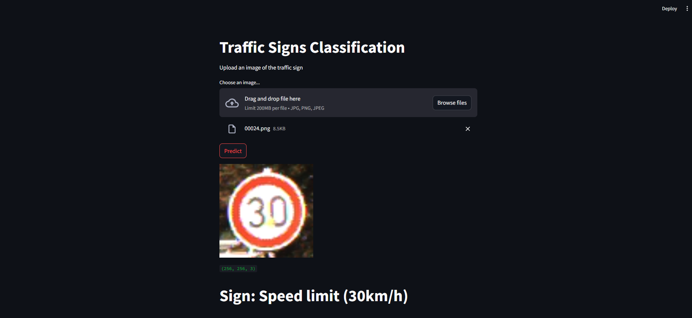

# Traffic Sign Classification

Convolutional Neural Network model build using Tensorflow and served as a demo using Streamlit.


## Data
Model was train on [GTSRB - German Traffic Sign Recognition Benchmark](https://www.kaggle.com/datasets/meowmeowmeowmeowmeow/gtsrb-german-traffic-sign) dataset from Kaggle.

## How to run it locally?
1. Clone the repository:
```console
git clone https://github.com/Rorjh/traffic_sign_classification.git
```
2. Create the virtual environment:
```console
virtualenv venv
```
3. Activate the environment:
```console
source venv/Scripts/activate     # Windows
source venv/bin/activate         # Linux
```
4. Install dependencies:
```console
pip install -r requirements.txt
```
5. Run the Streamlit app:
```console
streamlit run app.py
```
